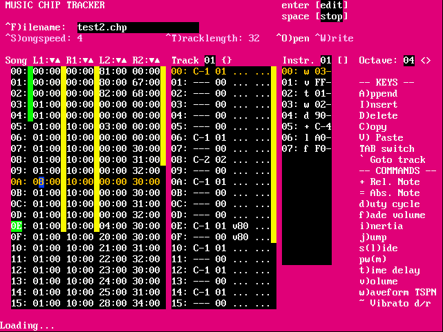

# Chiptracker

Chip tracker for the bitbox, based on  [lft's Hardware Chiptune](http://www.linusakesson.net/hardware/chiptune.php)

## Updated documentation (things that changed from lft's original tracker)

Start the tracker by loading the binary from the bitbox bootloader, or use the
emulator version.

* Press Ctrl+O to list and load files (from SD card or current directory in emu).
* Press Ctrl+F to change the file name, then Ctrl+W to save.
* Press space to play/pause, enter to toggle edit mode
* In the emulator, press escape to exit. On real hardware, use the reset button.

Don't worry, there are on-screen hints to all this.

## Original Documentation (with out of date information removed)

Hi!

This is the tracker I used in the
[hardware chiptune project](http://www.linusakesson.net/hardware/chiptune.php).
It was never intended to
be used by anyone other than me, so it's not exactly user friendly.

This is a quick documentation attempt.

Once you've started the tracker, you'll see that the screen is divided into
three sections: song, track and instrument. Use TAB to move between these
sections. Alternatively, if you're in the song section and the cursor is on a
track identifier, you can press ` (backquote) to start editing this track.

Use { and } to change the current track, and [ and ] to change the current
instrument. Use enter to start playing the current track (in the track section)
or the song (in the song section). Use space to stop playing or to enter edit
mode.

Use < and > to change the current octave. The main part of the keyboard is used
to enter notes. The keyboard layout is adapted for a US qwerty keymap. You can
edit gui.c to change this to fit a Dvorak keymap instead.

Press ^W ("write") to save. Press
\# to optimize the song (remove unused tracks, move tracks together).

In the song and instrument editors, use capital A, I and D to add, insert and
delete lines. In the track and instrument editors, use capital C and V for copy
and paste.

A line in the instrument editor is either a command, a relative note or an
absolute note. Relative notes are indicated by + in the command column,
absolute notes by =. Commands in the instrument editor are the same as commands
in the track editor.

The available commands are:

	dxx Set duty cycle (pulse width) to xx.
	fxx Set volume fade speed to xx. So, fff is a slow fadeout, f01 is a slow fadein.
	ixx Set channel inertia. A high inertia causes automatic slides between notes. Default 0.
	jxx Jump to instrument line xx. Used to create arpeggio loops.
		Warning: The loop must contain a delay element (t command), otherwise you'll crash the software.
	lxx Set sLide. So, lff is a slow slide down, l01 is a slow slide up.
	mxx Set pulse width modulation rate to xx.
	txx Wait xx time units.
	vxx Set channel volume to xx.
	wxx Set waveform. 00 = triangle, 01 = saw, 02 = pulse, 03 = noise.
	~xy Set vibrato. x = depth, y = rate.

Investigate test2.song, and play around, and you'll probably get the hang of
things!

Good luck!

Linus (lft^kryo)
